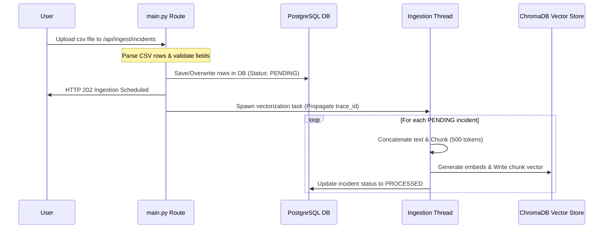
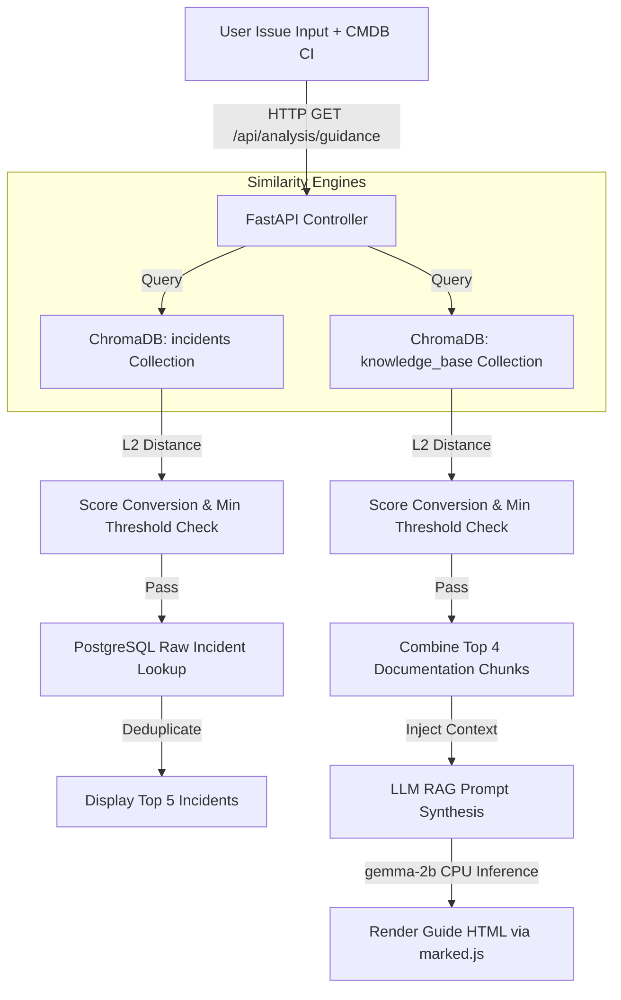

# Developer Handbook: Project Aura Logic & Flow Guide

This document serves as a detailed logic handbook for developers maintaining or expanding the **Project Aura** codebase. It outlines step-by-step logic execution pathways, database connection interactions, vector indexing operations, and telemetry parameters for every major feature.

---

## 1. System Core & Boot Initialization

The application initializes sequentially during boot within the lifespan of the `lifespan` manager in [app/main.py](file:///c:/Users/Roni/Documents/GitHub/project-aura/app/main.py):

### 1.1 Config & Models Verification
1.  **File:** [app/config.py](file:///c:/Users/Roni/Documents/GitHub/project-aura/app/config.py)
2.  Loads and parses `config.json`.
3.  Performs strict active-model validation:
    *   Verifies that exactly **one** model contains the `"Active": true` flag.
    *   If zero or multiple active models are found, raises a `ValueError` halting application startup.
4.  Scans local model paths under `OFFLINE_MODEL_HOME` (from the local `.env` configuration file). Verifies that the designated active model binary (e.g. `gemma-2-2b-it-Q4_K_M.gguf`) and the fallback model binary (`Phi-3.1-mini-4k-instruct-Q4_K_M.gguf`) physically exist.

### 1.2 Database & Telemetry Boot Setup
1.  **File:** [app/database.py](file:///c:/Users/Roni/Documents/GitHub/project-aura/app/database.py)
2.  Creates the PostgreSQL engine using SQLAlchemy `create_engine` loading parameters from the `.env` database connection string:
    ```python
    engine = create_engine(DATABASE_URL)
    SessionLocal = sessionmaker(autocommit=False, autoflush=False, bind=engine)
    ```
3.  Runs `Base.metadata.create_all(bind=engine)` to compile and create tables for all models: `incidents`, `knowledge_documents`, `categories`, `incident_searches`, `telemetry_logs`, `job_statuses`, and `deleted_actions`.

### 1.3 Vector Store Initialization
1.  **File:** [app/vector_store.py](file:///c:/Users/Roni/Documents/GitHub/project-aura/app/vector_store.py)
2.  Instantiates ChromaDB `PersistentClient` targeting `/.chromadb`.
3.  Loads local `all-MiniLM-L6-v2` embeddings in-memory to prevent standard ChromaDB libraries from initializing internet-bound Hugging Face requests:
    ```python
    embeddings = HuggingFaceEmbeddings(
        model_name="all-MiniLM-L6-v2",
        cache_folder=OFFLINE_MODEL_HOME
    )
    ```
4.  Creates or queries two active collection spaces: `"incidents"` and `"knowledge_base"`.

---

## 2. Ingesting & Vectorizing Incident Tickets

RAG search functionality relies on ingest data matching. The step-by-step logic for importing ticket logs is executed as follows:



### Step 2.1: CSV Parsing & Database Stage
1.  **Endpoint:** `POST /api/ingest/incidents` in [app/main.py](file:///c:/Users/Roni/Documents/GitHub/project-aura/app/main.py#L418-L476).
2.  FastAPI receives the multipart file upload `UploadFile`. It reads the raw contents into memory as a string using UTF-8 decoding.
3.  Parses headers case-insensitively. Validates that the input files match mandatory ticketing fields: `number`, `cmdb_ci`, `short_description`, `opened_by`, `state`, etc.
4.  Queries the PostgreSQL DB for duplicates. For each CSV row:
    *   If the incident number already exists in table `incidents` with status `PROCESSED`, it skips the row.
    *   If it exists but is marked `PENDING` or `FAILED`, or does not exist at all, the engine overwrites relational columns with incoming data and flags the `process_status` column as `PENDING`.
5.  Fires database transaction commits: `db.commit()`.

### Step 2.2: Asynchronous Vectorization Thread Dispatch
1.  Dispatches an asynchronous operating system thread:
    ```python
    parent_trace_id = trace_id_var.get()
    Thread(target=background_vectorize_incidents, args=(parent_trace_id,)).start()
    ```
2.  FastAPI returns an immediate HTTP response: `{"status": "SUCCESS", "message": "..."}`. The client form is unlocked instantly.

### Step 2.3: Chunking & Embedding Generation
1.  **Background Thread:** `background_vectorize_incidents(parent_trace_id)` runs in [app/main.py](file:///c:/Users/Roni/Documents/GitHub/project-aura/app/main.py#L55-L106).
2.  Propagates the trace context inside the new thread namespace: `trace_id_var.set(parent_trace_id)`.
3.  Initializes a database session context `db = SessionLocal()`.
4.  Queries all incidents marked `PENDING` in the database:
    ```python
    pending = db.query(Incident).filter(Incident.process_status == "PENDING").all()
    ```
5.  For each ticket in the database query:
    *   Creates a `single_incident_vectorization` telemetry sub-span.
    *   Concatenates text: `[short_desc] + [description] + [work_notes] + [closed_note]`.
    *   Applies token-based chunking in [app/parsers.py](file:///c:/Users/Roni/Documents/GitHub/project-aura/app/parsers.py): splits text into chunks of 500 tokens with an overlap parameters limit of 75 tokens.
    *   Generates a vector ID: `[incident_number]_chunk_[index]`.
    *   Generates metadata dictionary: `{"number": number, "cmdb_ci": cmdb_ci, "chunk_id": chunk_id}`. *ChromaDB Safety Rule: Nulls are converted to empty strings `""` to prevent vector store errors.*
    *   Applies ChromaDB client ingestion:
        ```python
        incidents_collection.add(documents=chunks, ids=ids, metadatas=metadatas)
        ```
    *   Updates PostgreSQL database record status: `inc.process_status = "PROCESSED"`.
    *   Logs success info to the child sub-span containing ticket details: `sub_span.message = f"Vectorized ticket {number}..."`.
6.  Commits the database transaction (`db.commit()`), releases DB locks, and closes the session.

---

## 3. Ingesting Technical Documentation (Knowledge Base)

Documentation ingestion processes PDF/Word files and populates the vector store:

### Step 3.1: Upload and SHA-256 Hash Verification
1.  **Endpoint:** `POST /api/ingest/knowledge` in [app/main.py](file:///c:/Users/Roni/Documents/GitHub/project-aura/app/main.py#L478-L585).
2.  Receives file parameters. Calculates SHA-256 hash value.
3.  Checks database table `knowledge_documents` for collision:
    *   If identical hash exists, skips processing.
    *   If the same filename exists in the database but with a different hash value:
        *   Deletes old vector index chunks matching the file name: `delete_knowledge_by_file(filename)`.
        *   Deletes relational document rows in database.
        *   Prepares to overwrite local processing files.

### Step 3.2: Parsing & Local Storage Management
1.  Moves the document to the `/knowledge_docs/pending/` directory.
2.  Extracts text content:
    *   **PDF:** Read page-by-page using `pypdf`. Extracts text metadata and page numbers.
    *   **DOCX:** Read paragraph-by-paragraph using `python-docx`.
3.  Splits text using 500-token chunk splits with 75-token overlaps.

### Step 3.3: ChromaDB Vectorization & Directory Promotion
1.  Prepares metadata for vectorization:
    *   **PDF metadata:** `{"filename": filename, "page_number": page_number}`.
    *   **DOCX metadata:** `{"filename": filename}`. *Safety Rule: page_number key is completely omitted for Word files to prevent ChromaDB None value errors.*
2.  Ingests vectors:
    ```python
    knowledge_collection.add(documents=chunks, ids=ids, metadatas=metadatas)
    ```
3.  Upon success:
    *   Writes document metadata rows to `knowledge_documents`.
    *   Moves physical file from `/pending/` to `/knowledge_docs/processed/`.
4.  Upon failure:
    *   Catches the parsing exception.
    *   Moves physical file to `/knowledge_docs/failed/`.

---

## 4. RAG Search & Incident Triage Pipeline

When a user executes a search request, semantic similarity engines and generation models run in parallel:



### Step 4.1: Pre-Filtering Vector Databases by CMDB CI
1.  **Endpoint:** `GET /api/analysis/guidance` in [app/main.py](file:///c:/Users/Roni/Documents/GitHub/project-aura/app/main.py#L653-L778).
2.  Receives string inputs: `query_text`, `cmdb_ci`, and `min_threshold`.
3.  Constructs a metadata pre-filter block for ChromaDB queries:
    ```python
    where_meta = {"cmdb_ci": cmdb_ci}
    ```
    This forces ChromaDB to exclude any ticket vectors that do not match the specified CMDB CI.

### Step 4.2: Similarity Calculations & Match Score Thresholding
1.  Queries ChromaDB matching incidents:
    ```python
    results = incidents_collection.query(
        query_texts=[query_text], n_results=10, where=where_meta
    )
    ```
2.  Computes match scores for both incidents and document chunks:
    $$\text{Match Score (\%)} = \max\left(0, \left(1 - \frac{\text{L2 Distance}}{2}\right) \times 100\right)$$
3.  Filters out low-confidence results:
    *   For incidents: Discards any ticket where `match_score < min_threshold`.
    *   For knowledge documents: Discards any chunk where `match_score < min_threshold`.
    *   *Result:* Resolves RAG hallucination issues. Unrelated inputs like `"This is a test incident"` discard all manual chunks, preventing synthesis of incorrect guidelines.

### Step 4.3: Relational Lookup & RAG Synthesis
1.  **Historical Incidents Resolution:**
    *   Extracts unique incident numbers from surviving vectors.
    *   Queries the PostgreSQL `incidents` table to fetch raw fields (`assigned_to`, `assignment_group`, `closed_note`).
    *   Caps results at the top 5 deduplicated matching tickets.
2.  **Assistant Resolution Guide Synthesis (RAG):**
    *   Combines the top 4 surviving documentation chunks into a single context string.
    *   If no chunks survive the threshold checks, bypasses the LLM inference call and returns: `"No matching documentation found. Proceed with standard diagnostics."`
    *   If chunks exist, builds the prompt injecting the context and triggers LLM completion:
        ```python
        raw_response = model_manager.generate_completion(
            user_prompt=prompt, system_prompt=system_prompt, max_tokens=600
        )
        ```
    *   Appends citations (source filenames) matching the chunks.
3.  FastAPI returns the compiled payload to the client interface. The browser parses markdown in real-time using `marked.min.js`.

---

## 5. Asynchronous Bulk Triage

To process multiple incidents simultaneously without server timeouts, Bulk Triage executes asynchronously:

### Step 5.1: Task Registration & Background Trigger
1.  **Endpoint:** `POST /api/analysis/bulk-triage` in [app/main.py](file:///c:/Users/Roni/Documents/GitHub/project-aura/app/main.py#L827-L888).
2.  Receives bulk CSV file parameter. Validates column headers (`description`, `cmdb_ci`).
3.  Generates a unique `job_id` using `secrets.token_hex(16)`.
4.  Creates an active tracker state in the memory registry `BULK_TRIAGE_RUNS`:
    ```python
    BULK_TRIAGE_RUNS[job_id] = {
        "status": "RUNNING",
        "total": len(parsed_rows),
        "processed": 0,
        "results": [],
        "error": None
    }
    ```
5.  Updates database table `job_statuses` for `"bulk_triage"` to `is_running=True` and sets `total_items`.
6.  Triggers the async background worker task:
    ```python
    background_tasks.add_task(async_bulk_triage_worker, job_id, parsed_rows, parent_trace_id, db)
    ```
7.  Immediately returns `{"job_id": job_id, "status": "RUNNING"}`.

### Step 5.2: Background Execution & Polling Loops
1.  **Worker Task:** `async_bulk_triage_worker` loops over parsed rows.
2.  For each row, it calls `search_guidance` to fetch historical incidents and RAG synthesis.
3.  After processing each item:
    *   Increments `processed` count in memory registry.
    *   Updates `processed_items` in table `job_statuses` and commits.
4.  Upon completion, updates status to `"COMPLETED"` and saves final results array.
5.  **Client-Side:** The browser page polls `/api/analysis/bulk-triage/status/{job_id}` every 800ms. It calculates progress percentage: `(processed / total) * 100`. It updates progress bars and text indicators until completed, then renders the results cards.

---

## 6. Macro Categorization Engine

Scans and classifies unassigned ticket records in PostgreSQL using the local LLM:

### Step 6.1: Scanning Unclassified Records
1.  **Endpoint:** `POST /api/analysis/categorize` in [app/main.py](file:///c:/Users/Roni/Documents/GitHub/project-aura/app/main.py#L588-L606).
2.  Checks table `job_statuses` to prevent concurrent categorization runs.
3.  Spawns `background_macro_categorization` in a separate thread.

### Step 6.2: Classification Loop & Gradual Database Commits
1.  **Worker Task:** `background_macro_categorization` in [app/main.py](file:///c:/Users/Roni/Documents/GitHub/project-aura/app/main.py#L108-L208).
2.  Queries processed incidents that are missing category records:
    ```python
    unclassified = db.query(Incident).filter(Incident.process_status == "PROCESSED").filter(
        ~Incident.number.in_(db.query(Category.number))
    ).limit(BATCH_LIMIT).all()
    ```
3.  Updates `job_statuses` table setting `total_items = len(unclassified)`.
4.  For each incident in the batch:
    *   Compiles user prompts containing ticket details and system constraints.
    *   Triggers local LLM completion. Parses the returning raw JSON:
        ```json
        {
          "category": "Assigned Category",
          "error_codes": "None",
          "error_messages": "None"
        }
        ```
    *   Saves the record to database table `categories`.
    *   Updates `processed_items` in table `job_statuses` and calls `db.commit()`. Committing inside the loop ensures that progress registers gradually and consistently.
5.  Resets job status `is_running = False` in PostgreSQL upon batch completion.

---

## 7. Telemetry & Grouped Transaction Tracing

Telemetry logs are structured around a transaction-centric parent-child relationship (similar to LangSmith):

### 7.1 Span Logging & Context Managers
1.  **File:** [app/telemetry.py](file:///c:/Users/Roni/Documents/GitHub/project-aura/app/telemetry.py#L25-L71)
2.  Executing blocks wrapped in `with telemetry_span("event_name") as span:`:
    *   Retrieves the thread-local trace ID: `trace_id_var.get()`. If empty, generates a hex token.
    *   Generates a unique `span_id`.
    *   Yields control. Catches exceptions and sets status to `ERROR` if raised.
    *   Measures execution duration. Writes telemetry rows directly into table `telemetry_logs`.

### 7.2 Parent-Child Grouping Logic
1.  **Endpoint:** `GET /api/settings/logs` in [app/main.py](file:///c:/Users/Roni/Documents/GitHub/project-aura/app/main.py#L936-L1035).
2.  Extracts distinct transaction trace IDs:
    ```python
    p_query = db.query(TelemetryLog)
    # Queries high-level parent logs (e.g. knowledge_ingestion, bulk_triage, etc.)
    parent_logs = p_query.order_by(TelemetryLog.timestamp.desc()).limit(30).all()
    ```
3.  Fetches all telemetry log entries associated with those trace IDs.
4.  Iterates over the results:
    *   If log type is a parent event (e.g. `knowledge_ingestion` or `incident_ingestion`), it defines the main group.
    *   If log type is a child operation (e.g. `single_incident_vectorization`), it appends it to the parent group's `children` array:
        ```python
        groups[tid]["children"].append(span_data)
        ```
5.  **Settings UI Rendering:** The settings page displays the main transactions as table rows with chevron toggles (`▶`). Clicking a row expands it to display the child sub-spans table, detailing the execution times of individual operations.
6.  **Log CSV Exporter:** `/api/settings/export-logs` reads this hierarchy and exports a formatted CSV with child rows indented (`  └─ CHILD_SPANS`) below their parent transactions.

---

## 8. Database Settings & Application Reset Setup

For ease of installation and resetting, settings endpoints manage system state:

### 8.1 Diagnostics Checks
1.  **Endpoint:** `GET /api/settings/diagnostics` in [app/main.py](file:///c:/Users/Roni/Documents/GitHub/project-aura/app/main.py#L1089-L1153).
2.  Checks three database connectivity states:
    *   **PostgreSQL:** Executes a raw SQL verification check: `db.execute(text("SELECT 1"))`.
    *   **ChromaDB:** Verifies if client collections can be queried.
    *   **Models:** Validates that active and fallback model binaries exist in the designated offline directories.

### 8.2 Seeding & Application Reset
1.  **Endpoint:** `POST /api/settings/reset-install` in [app/main.py](file:///c:/Users/Roni/Documents/GitHub/project-aura/app/main.py#L1155-L1207).
2.  Performs complete clean installations:
    *   Drops all SQLAlchemy database tables: `Base.metadata.drop_all(bind=engine)`.
    *   Recreates tables: `Base.metadata.create_all(bind=engine)`.
    *   Seeds default rows into `job_statuses` table for `macro_categorization` and `bulk_triage`.
    *   Deletes ChromaDB incident and knowledge collections and recreates them empty with L2 space configurations.
    *   Clears physical files in the directories `/pending/`, `/processed/`, and `/failed/`.
    *   Resets diagnostics markers. Returns `SUCCESS` response to UI.

---

## 9. Developer Troubleshooting Checklist

When debugging local system failures:

1.  **FastAPI startup crashes with `ValueError`:**
    *   Check `config.json` in the root folder. Verify that exactly **one** model has `"Active": true` set.
2.  **API requests fail with PostgreSQL errors:**
    *   Verify that your local PostgreSQL service is running.
    *   Check credentials (`DATABASE_URL`) in the local `.env` file.
3.  **Logs show `RuntimeMemoryOut` or memory allocation faults:**
    *   Verify that the fallback model binary matches the path designated in `config.json`.
    *   Review `telemetry_logs` entries on the settings tab to trace the OOM fallback chain.
4.  **ChromaDB queries fail with `None` metadata type errors:**
    *   Verify that document/incident metadata dictionary generators omit keys containing `None` values (e.g. omitting `page_number` for `.docx` uploads).
5.  **Logs page crashes with "Unexpected token 'I'":**
    *   Check the uvicorn terminal console for SQL trace compilation errors.
    *   Ensure that distinct query parameters comply with PostgreSQL sorting restrictions.
6.  **Progress bar does not update gradually:**
    *   Confirm that `db.commit()` is called inside the background processing loops.
    *   Verify that `/api/analysis/job-status` returns the updated database progress columns.
