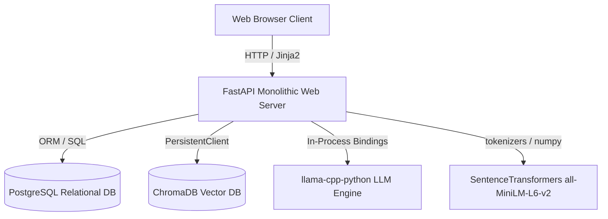

# Implementation Plan - Project Aura

Project Aura is a fully offline, air-gapped incident analysis and knowledge-synthesis system designed to run FastAPI, PostgreSQL, ChromaDB, and local GGUF models on a CPU-bound laptop.

---

## User Review Required

> [!IMPORTANT]
> **External Dependencies & Offline Compilation**
> Installing `llama-cpp-python` on Windows usually requires Visual Studio C++ Build Tools. Since the wheel is available on a CPU-only URL (`https://abetlen.github.io/llama-cpp-python/whl/cpu`), we will configure `pip` to pull this precompiled wheel during setup. This bypasses the need for local MSVC/CMake compiler toolchains on the laptop.

> [!NOTE]
> **Browsers and `file://` URL Navigation**
> Modern web browsers restrict clicking direct `file://` links from HTTP pages for security. To ensure a premium UX, we will implement a FastAPI file server route (`/files/{filename}`) that streams the documents from `/knowledge_docs/processed/` using `FileResponse`, allowing direct download or inline viewing in the browser.

---

## Proposed Changes

We will construct a modular, single-layer FastAPI application.

### Component Structure & Directories

We will initialize the following directory layout in the project workspace:

- `/app` — Contains all core python modules.
- `/app/static` — CSS, client JS, images.
- `/app/templates` — Jinja2 HTML templates.
- `/knowledge_docs/pending`, `/knowledge_docs/processed`, `/knowledge_docs/failed` — Knowledge Base storage.
- `/.chromadb` — ChromaDB persistent data directory.
- `.env` — Configuration file containing database credentials and local model home path.
- `config.json` — Local model declaration list and batch limits.

---

### Database Layer (`PostgreSQL` Integration)

#### [database.py](file:///c:/Users/Roni/Documents/GitHub/project-aura/app/database.py)
This module manages database connections using SQLAlchemy and defines the ORM models.

- **`Incident` table**:
  - `number` (VARCHAR PK)
  - `cmdb_ci` (VARCHAR)
  - `short_desc` (TEXT)
  - `description` (TEXT)
  - `work_notes` (TEXT)
  - `closed_note` (TEXT)
  - `sys_created_on` (TIMESTAMP WITH TIME ZONE)
  - `process_status` (VARCHAR) — `PENDING`, `PROCESSED`, `FAILED`
- **`KnowledgeDocument` table**:
  - `id` (SERIAL PK)
  - `filename` (VARCHAR)
  - `hash_value` (VARCHAR)
  - `processed_date` (TIMESTAMP WITH TIME ZONE)
- **`Category` table**:
  - `id` (SERIAL PK)
  - `number` (VARCHAR FK referencing `incidents.number`)
  - `assigned_cat` (VARCHAR)
  - `error_codes` (TEXT)
  - `error_msgs` (TEXT)
- **`IncidentSearch` table**:
  - `search_id` (UUID PK)
  - `query_text` (TEXT)
  - `matched_incs` (JSONB)
  - `rag_response` (TEXT)
  - `citations` (JSONB)
- **`TelemetryLog` table**:
  - `id` (SERIAL PK)
  - `timestamp` (TIMESTAMP WITH TIME ZONE)
  - `trace_id` (VARCHAR(32))
  - `span_id` (VARCHAR(16))
  - `event_name` (VARCHAR(255))
  - `duration_ms` (INTEGER)
  - `token_count` (INTEGER)
  - `status` (VARCHAR(50))
  - `exception_type` (TEXT)
  - `message` (TEXT)
- **`JobStatus` table**:
  - `job_name` (VARCHAR PK)
  - `is_running` (BOOLEAN)
  - `total_items` (INTEGER)
  - `processed_items` (INTEGER)
- **`DeletedAction` table**:
  - `id` (SERIAL PK)
  - `timestamp` (TIMESTAMP WITH TIME ZONE)
  - `item_type` (VARCHAR)
  - `item_identifier` (VARCHAR)
  - `details` (TEXT)

---

### Vector DB & Embedding Layer (`ChromaDB` Integration)

#### [vector_store.py](file:///c:/Users/Roni/Documents/GitHub/project-aura/app/vector_store.py)
Initializes ChromaDB as a `PersistentClient` targeting `/.chromadb`.
- Uses `SentenceTransformer` locally to load `all-MiniLM-L6-v2` from the offline folder.
- Creates/manages two collections:
  - `incidents_collection`
  - `knowledge_collection`
- Implements custom embedding class `LocalEmbeddingFunction` to prevent default ChromaDB internet fetches.

---

### Parsing & Ingestion Layer

#### [parsers.py](file:///c:/Users/Roni/Documents/GitHub/project-aura/app/parsers.py)
Implements CSV schema verification and document parsers.
- **CSV Ingestion**: Validates column schemas case-insensitively. Safely handles quotation marks, commas, and formatting. Overwrites `process_status != 'PROCESSED'` and sets to `PENDING` for vectorization.
- **PDF Parser**: Uses `pypdf` to extract text page-by-page.
- **DOCX Parser**: Uses `python-docx` to extract text from DOCX documents.
- **SHA-256 Hasher**: Verifies file uniqueness. Handles file updates (deletes existing DB records and ChromaDB chunks if filename exists but hash differs).

---

### Model Orchestration & Memory Fallback

#### [models_orchestrator.py](file:///c:/Users/Roni/Documents/GitHub/project-aura/app/models_orchestrator.py)
Validates local configuration files and orchestrates LLM instance generation.
- Reads `config.json` and ensures exactly one active model. If not, throws a hard configuration exception.
- Instantiates `Llama` from `llama-cpp-python`.
- **Memory Fallback**: Wraps the initialization in a try-except block. If OOM/exception occurs, writes a warning log into `telemetry_logs`, disables the failing model, and silently falls back to load `Phi-3.1-mini-4k-instruct-Q4_K_M.gguf`.

---

### Backend Logic & API Layer

#### [main.py](file:///c:/Users/Roni/Documents/GitHub/project-aura/app/main.py)
Aggregates all routes and startup handlers.
- **API Routes**:
  - `/api/ingest/incidents` — Upload CSV.
  - `/api/ingest/knowledge` — Upload DOCX/PDF.
  - `/api/analysis/categorize` — Trigger async batch categorization.
  - `/api/analysis/guidance` — Single Guidance search.
  - `/api/analysis/bulk-triage` — Bulk Triage CSV upload.
  - `/api/analysis/bulk-triage/status/{job_id}` — Get bulk triage progress and results.
  - `/api/settings/export-logs` — Export transaction telemetry logs as CSV.
  - `/files/{filename}` — Streams processed files.
- **Jinja2 UI Routing**:
  - `/` — Homepage / System Analytics (displays performance counters and latency metrics).
  - `/knowledge` — Incident & Document ingestion dashboard.
  - `/categorization` — Categorization job status, execution triggers, and dashboard charts.
  - `/guidance` — Incident search interface & bulk upload form.

---

### UI/UX Styling & Theme Layer

#### [style.css](file:///c:/Users/Roni/Documents/GitHub/project-aura/app/static/style.css)
Declares the global styling rules following the design standards.
- Uses centralized CSS variables for Theme Control.
  - **Light Theme**: Primary = `#FFFFFF`, Secondary = `#000000`, Accent = `#808080`.
  - **Dark Theme**: Primary = `#000000`, Secondary = `#808080`, Accent = `#FFFFFF`.
- Applies rounded corners, subtle drop shadows, and professional margins. Flashy colors or heavy decorative animations are explicitly avoided.
- A theme toggle switcher in the global header updates the variables.

---

## Verification Plan

### Automated Tests
We will write automated test scripts in `tests/test_pipelines.py` to verify:
1. **Model Configuration Validation:** Test that booting throws an error if zero or multiple active models are declared in `config.json`.
2. **Memory Fallback Verification:** Test that if model loading fails, the system successfully boots into the fallback `Phi-3.1` model.
3. **Database Operations:** Verify standard operations on all tables and confirm OTel Telemetry logging works correctly.

### Manual Verification
1. **Isolated Sandbox Mode:** Disable local network adapters or isolate the port to verify that the app initializes and executes searches completely offline.
2. **OOM Telemetry Logging:** Trigger a simulated model initialization error to confirm that warning records are written directly to `telemetry_logs`.
3. **UI Themes:** Manually toggle between Light and Dark mode on all views.
4. **Browser Download Check:** Verify that clicking citation links downloads/opens the PDF/DOCX documents directly in the browser via `/files/{filename}`.
